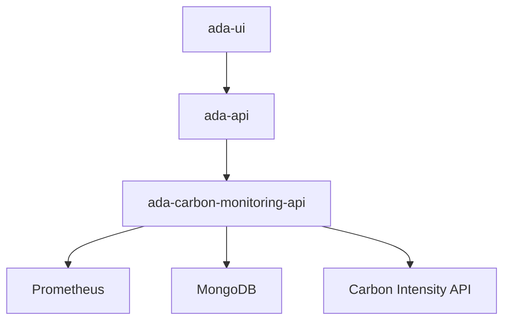

# Technology Stack

This page documents the technologies used in the Ada Carbon Monitoring system.

## External APIs

### UK Carbon Intensity API

The [Carbon Intensity API](https://carbon-intensity.github.io/api-definitions/#carbon-intensity-api-v2-0-0) provides real-time and forecast data about the carbon intensity of UK electricity generation.

- **Endpoint:** `https://api.carbonintensity.org.uk/intensity`
- **Data:** gCO2/kWh for each 30-minute period
- **Coverage:** Great Britain (England, Scotland, Wales)
- **Update frequency:** Every 30 minutes

We use this API to:
- Get current carbon intensity for real-time calculations
- Get 24/48 hour forecasts for the intensity chart
- Calculate carbon footprint from electricity usage

## Databases

### Prometheus

[Prometheus](https://prometheus.io/) is our time-series database for CPU metrics.

**What it stores:**
- `node_cpu_seconds_total` - CPU time by mode (busy/idle/user/system)
- Labels: `cloud_project_name`, `machine_name`, `instance`, `mode`

**How we query it:**
```promql
increase(node_cpu_seconds_total{
    cloud_project_name="IDAaaS",
    machine_name="Muon"
}[1h])
```

**Data collection:**
- `node_exporter` runs on each VM
- Scrapes CPU metrics from `/proc/stat`
- Prometheus pulls data every 15 seconds

**Our Prometheus server:** `https://host-172-16-100-248.nubes.stfc.ac.uk/`

### MongoDB

[MongoDB](https://www.mongodb.com/) stores workspace and user data through the Ada platform.

**Key collections:**
| Collection | Purpose |
|------------|---------|
| `workspaces` | Active and historical workspace records |
| `users` | User information (platform_name, email, tag) |
| `groups` | Experiment groups (RB numbers, training courses) |

**Access method:** Via `ada-db-interface` REST API

**Example workspace document:**
```json
{
    "_id": ObjectId("..."),
    "hostname": "host-172-16-100-50.nubes.stfc.ac.uk",
    "owner": "aa123456",
    "tag": "ISIS",
    "state": "READY",
    "created_time": ISODate("2026-01-28T09:00:00Z")
}
```

{: .warning }
> **SQLite is deprecated.** Earlier documentation referenced SQLite for local storage. The current implementation uses MongoDB exclusively.

## Programming Languages

### Python

Backend development uses Python 3.11+ with:
- **FastAPI** - Modern async web framework
- **Pydantic** - Data validation and settings management
- **uvicorn** - ASGI server
- **requests** - HTTP client
- **pymongo** - MongoDB driver

### JavaScript/TypeScript

Frontend development uses:
- **Svelte** - Component framework
- **Vite** - Build tool and dev server
- **Chart.js** - Charting library

## Backend Framework

### FastAPI

[FastAPI](https://fastapi.tiangolo.com/) is our backend framework, chosen for:
- Automatic OpenAPI documentation
- Type hints and validation
- Async support
- High performance

**Key features used:**
- APIRouter for modular endpoints
- Dependency injection
- Pydantic models for request/response validation
- Background tasks

**Example endpoint:**
```python
from fastapi import APIRouter, Query
from pydantic import BaseModel

router = APIRouter(prefix="/carbon")

class CarbonResponse(BaseModel):
    intensity: float
    index: str

@router.get("/intensity/current", response_model=CarbonResponse)
async def get_current_intensity():
    client = CarbonIntensityAPIClient()
    return client.get_current_intensity()
```

{: .note }
> Earlier documentation mentioned Flask. The implementation now uses FastAPI.

## Frontend Framework

### Svelte

[Svelte](https://svelte.dev/) is our frontend framework in `ada-ui`.

**Key features:**
- Reactive declarations
- Component scoped styles
- No virtual DOM (compiles to vanilla JS)
- Small bundle size

**Example component:**
```svelte
<script>
  import { onMount } from "svelte";
  import { getCurrentIntensity } from "$api/carbon";

  let intensity = null;

  onMount(async () => {
    intensity = await getCurrentIntensity();
  });
</script>

<div class="intensity">
  {#if intensity}
    <span>{intensity.intensity} gCO2/kWh</span>
  {:else}
    <span>Loading...</span>
  {/if}
</div>
```

### Chart.js

[Chart.js](https://www.chartjs.org/) renders our data visualizations:
- Line charts (carbon intensity forecast)
- Bar charts (stacked busy/idle breakdown)
- Custom plugins (heatmap, annotations)

### SMUI (Svelte Material UI)

[SMUI](https://sveltematerialui.com/) provides Material Design components:
- Buttons, cards, dialogs
- Progress indicators
- Form components

## Documentation

### Jekyll

[Jekyll](https://jekyllrb.com/) generates this documentation site.

**Theme:** Just the Docs
**Hosting:** GitHub Pages

### Mermaid.js

[Mermaid.js](https://mermaid.js.org/) renders diagrams in documentation:



## Development Tools

| Tool | Purpose |
|------|---------|
| Git | Version control |
| pytest | Python testing |
| Playwright | E2E testing |
| ESLint | JavaScript linting |
| Black | Python formatting |

## Deployment

| Component | Technology |
|-----------|------------|
| Backend | Docker / systemd |
| Frontend | Nginx / Node |
| Database | Managed MongoDB |
| Metrics | Prometheus + node_exporter |
