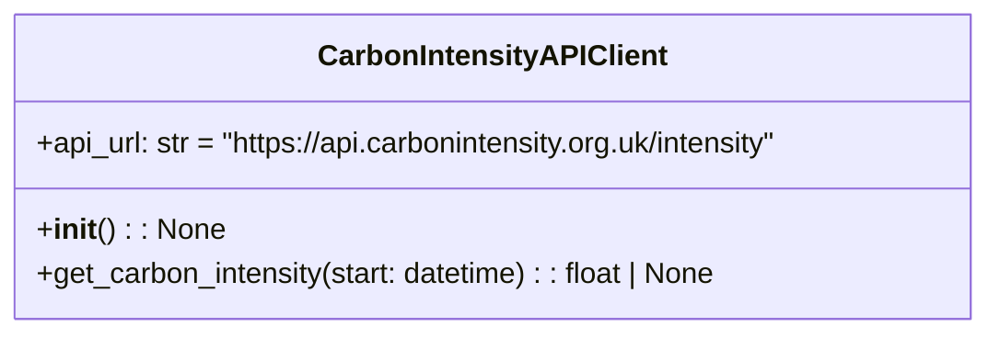

# Class Diagram

```mermaid
classDiagram
    class CarbonIntensityAPIClient {
        +api_url: str = "https://api.carbonintensity.org.uk/intensity"
        +__init__(): None
        +get_carbon_intensity(start: datetime): float | None
    }
```