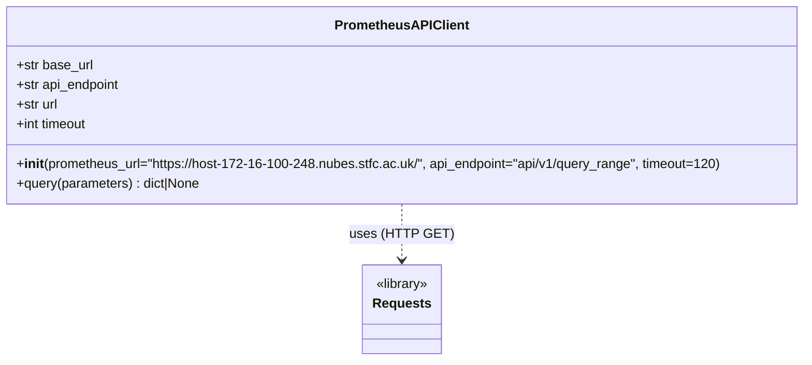

# Class Diagram

```mermaid
classDiagram
    class PrometheusAPIClient {
        +str base_url
        +str api_endpoint
        +str url
        +int timeout
        +__init__(prometheus_url="https://host-172-16-100-248.nubes.stfc.ac.uk/", api_endpoint="api/v1/query_range", timeout=120)
        +query(parameters) dict|None
    }

    class Requests
    <<library>> Requests

    PrometheusAPIClient ..> Requests : uses (HTTP GET)
```