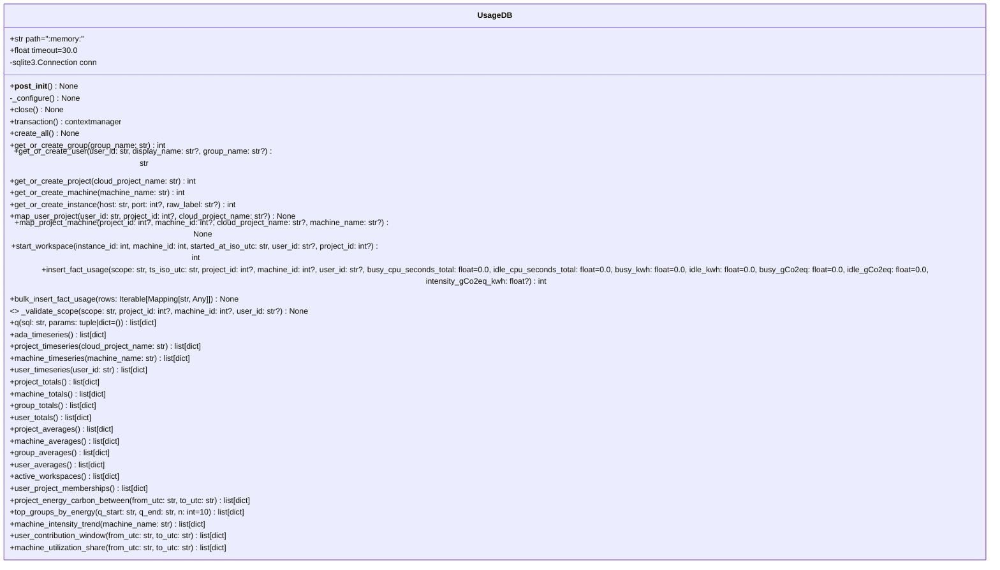

## Class Diagram

```mermaid
classDiagram
    class UsageDB {
        +str path=":memory:"
        +float timeout=30.0
        -sqlite3.Connection conn

        +__post_init__() None
        -_configure() None
        +close() None
        +transaction() contextmanager
        +create_all() None

        %% get-or-create
        +get_or_create_group(group_name: str) int
        +get_or_create_user(user_id: str, display_name: str?, group_name: str?) str
        +get_or_create_project(cloud_project_name: str) int
        +get_or_create_machine(machine_name: str) int
        +get_or_create_instance(host: str, port: int?, raw_label: str?) int

        %% mapping
        +map_user_project(user_id: str, project_id: int?, cloud_project_name: str?) None
        +map_project_machine(project_id: int?, machine_id: int?, cloud_project_name: str?, machine_name: str?) None

        %% workspaces
        +start_workspace(instance_id: int, machine_id: int, started_at_iso_utc: str, user_id: str?, project_id: int?) int

        %% facts
        +insert_fact_usage(scope: str, ts_iso_utc: str, project_id: int?, machine_id: int?, user_id: str?, busy_cpu_seconds_total: float=0.0, idle_cpu_seconds_total: float=0.0, busy_kwh: float=0.0, idle_kwh: float=0.0, busy_gCo2eq: float=0.0, idle_gCo2eq: float=0.0, intensity_gCo2eq_kwh: float?) int
        +bulk_insert_fact_usage(rows: Iterable[Mapping[str, Any]]) None
        <<static>> _validate_scope(scope: str, project_id: int?, machine_id: int?, user_id: str?) None

        %% queries
        +q(sql: str, params: tuple|dict=()) list[dict]
        +ada_timeseries() list[dict]
        +project_timeseries(cloud_project_name: str) list[dict]
        +machine_timeseries(machine_name: str) list[dict]
        +user_timeseries(user_id: str) list[dict]

        +project_totals() list[dict]
        +machine_totals() list[dict]
        +group_totals() list[dict]
        +user_totals() list[dict]

        +project_averages() list[dict]
        +machine_averages() list[dict]
        +group_averages() list[dict]
        +user_averages() list[dict]

        +active_workspaces() list[dict]
        +user_project_memberships() list[dict]

        +project_energy_carbon_between(from_utc: str, to_utc: str) list[dict]
        +top_groups_by_energy(q_start: str, q_end: str, n: int=10) list[dict]
        +machine_intensity_trend(machine_name: str) list[dict]
        +user_contribution_window(from_utc: str, to_utc: str) list[dict]
        +machine_utilization_share(from_utc: str, to_utc: str) list[dict]
    }
```