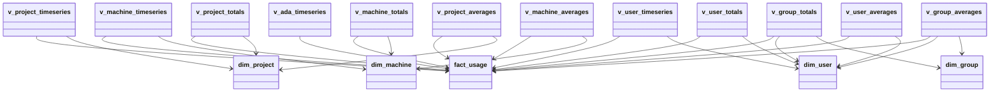

# Todo
* Make the diagram fit the page better

# Dependency Diagram

```mermaid
classDiagram
  class fact_usage
  class dim_project
  class dim_machine
  class dim_user
  class dim_group

  class v_ada_timeseries
  class v_project_timeseries
  class v_machine_timeseries
  class v_user_timeseries

  class v_project_totals
  class v_machine_totals
  class v_group_totals
  class v_user_totals

  class v_project_averages
  class v_machine_averages
  class v_group_averages
  class v_user_averages

  v_ada_timeseries     --> fact_usage
  v_project_timeseries --> fact_usage
  v_project_timeseries --> dim_project
  v_machine_timeseries --> fact_usage
  v_machine_timeseries --> dim_machine
  v_user_timeseries    --> fact_usage
  v_user_timeseries    --> dim_user

  v_project_totals     --> fact_usage
  v_project_totals     --> dim_project
  v_machine_totals     --> fact_usage
  v_machine_totals     --> dim_machine
  v_group_totals       --> fact_usage
  v_group_totals       --> dim_user
  v_group_totals       --> dim_group
  v_user_totals        --> fact_usage
  v_user_totals        --> dim_user

  v_project_averages   --> fact_usage
  v_project_averages   --> dim_project
  v_machine_averages   --> fact_usage
  v_machine_averages   --> dim_machine
  v_group_averages     --> fact_usage
  v_group_averages     --> dim_user
  v_group_averages     --> dim_group
  v_user_averages      --> fact_usage
  v_user_averages      --> dim_user
```
