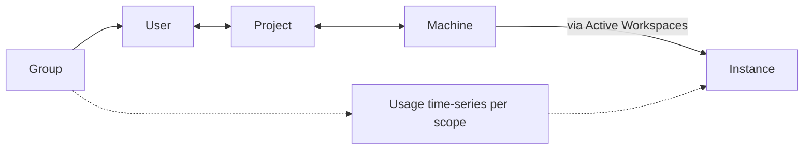

## Mental model

* **Groups** contain **Users** (`dim_group → dim_user`).
* **Users** can be members of many **Projects**, and Projects have many Users (`map_user_project`).
* **Projects** run on many **Machines**, and Machines may serve many Projects (`map_project_machine`).
* **Instances** are network endpoints (`host`, `port`) that Machines expose; they’re referenced by **Active Workspaces** to describe an active session.
* **Usage facts** live in **one flexible time-series** table (`fact_usage`), keyed by `(scope, ts, [project|machine|user])` depending on scope. You slice-and-aggregate to get totals/averages.



---

## Conventions & units

* **Time**: `ts` is **ISO‑8601 UTC** (e.g. `2025-09-11T10:30:00Z`). Always filter time ranges explicitly.
* **Units**:

  * CPU time: `*_cpu_seconds_total` (seconds)
  * Energy: `*_kwh` (kWh)
  * Carbon: `*_gCo2eq` (grams CO₂e)
  * Carbon intensity: `intensity_gCo2eq_kwh` (gCO₂e/kWh). If `NULL`, compute from `busy/idle` energy & carbon.
* **Identity**: `dim_user.user_id` is a **stable external ID** (text). `display_name` is for UI only.
* **Nulls**: In `fact_usage`, only the ID relevant to the row’s `scope` is set; the other two are `NULL`.

---

## Table catalog

### 3.1 Dimension tables

**`dim_group`**
Purpose: User grouping for reporting.
Columns: `group_id` (PK), `group_name` (unique).

**`dim_user`**
Purpose: End users tied to a group.
Columns: `user_id` (PK, text), `display_name`, `group_id` → `dim_group` (nullable; cascades on update, set null on delete).

**`dim_project`**
Purpose: Cloud or org project space.
Columns: `project_id` (PK), `cloud_project_name` (unique).

**`dim_machine`**
Purpose: Physical/virtual machine identity.
Columns: `machine_id` (PK), `machine_name` (unique).

**`dim_instance`**
Purpose: Network endpoint for a running service.
Columns: `instance_id` (PK), `host` (not null), `port`, `raw_label` (freeform source label).


### 3.2 Many‑to‑many bridges

**`map_user_project`**
Links Users ↔ Projects. PK (`user_id`, `project_id`). Deletes cascade.

**`map_project_machine`**
Links Projects ↔ Machines. PK (`project_id`, `machine_id`). Deletes cascade.

### 3.3 Fact: flexible usage time‑series

**`fact_usage`**
**Grain**: One row per `(scope, ts, key)` where **key** is empty or one of `{project_id | machine_id | user_id}` depending on `scope`.

* `scope`: one of `'ada' | 'project' | 'machine' | 'user'`.
* Key presence enforced by a `CHECK` constraint.
* **Uniqueness**: Per time grain using a composite unique constraint that treats NULLs consistently.
* Helpful indexes exist on `ts`, `scope`, and each foreign key (partial where not null).

> Why one table? It centralizes ingestion & indexing and avoids four near‑identical tables. Views provide the expected per‑entity time‑series.

### 3.4 Activity: live sessions

**`active_workspace`**
Represents an **ongoing** session on a Machine/Instance, optionally tied to a User and Project.
Columns: `workspace_id` (PK), `instance_id` → `dim_instance`, `machine_id` → `dim_machine`, `user_id` → `dim_user` (nullable), `project_id` → `dim_project` (nullable), `started_at` (ISO‑8601 UTC).

> Per‑workspace energy/carbon **do not** live here; they are captured in `fact_usage`.

---

## Provided views

### 4.1 Time‑series 

* `v_ada_timeseries`: Global (Ada) metrics by `ts`.
* `v_project_timeseries`: Project‑specific metrics by `ts` (includes `cloud_project_name`).
* `v_machine_timeseries`: Machine‑specific metrics by `ts`.
* `v_user_timeseries`: User‑specific metrics by `ts`.

Each view exposes: `ts`, `busy_cpu_seconds_total`, `idle_cpu_seconds_total`, `busy_kwh`, `idle_kwh`, `busy_gCo2eq`, `idle_gCo2eq`, and `intensity_gCo2eq_kwh` (explicit if provided, otherwise computed).

### 4.2 Totals (sum over all time unless you filter)

* `v_project_totals`, `v_machine_totals`, `v_group_totals`, `v_user_totals`.

> These **do not** filter by time on their own. To report on a period, aggregate the base time‑series (`fact_usage` or the time‑series views) with a `WHERE ts BETWEEN ...`.

### 4.3 Averages (arithmetic mean of row values)

* `v_project_averages`, `v_machine_averages`, `v_group_averages`, `v_user_averages`.

> “Average” here means mean across rows (e.g., intervals). 

---

## Canonical join paths

```sql
-- Users in a Group
SELECT u.user_id, u.display_name
FROM dim_user u
JOIN dim_group g ON g.group_id = u.group_id
WHERE g.group_name = :group_name;

-- Machines serving a Project
SELECT m.machine_name
FROM map_project_machine pm
JOIN dim_machine m ON m.machine_id = pm.machine_id
JOIN dim_project p ON p.project_id = pm.project_id
WHERE p.cloud_project_name = :project;

-- Projects a User belongs to
SELECT p.cloud_project_name
FROM map_user_project up
JOIN dim_project p ON p.project_id = up.project_id
WHERE up.user_id = :user_id;
```

---

##  Query cookbook 

### Active workspaces right now

```sql
SELECT aw.workspace_id,
       aw.started_at,
       u.display_name AS user,
       p.cloud_project_name AS project,
       m.machine_name AS machine,
       i.host, i.port
FROM active_workspace aw
JOIN dim_machine   m ON m.machine_id  = aw.machine_id
JOIN dim_instance  i ON i.instance_id = aw.instance_id
LEFT JOIN dim_user u ON u.user_id     = aw.user_id
LEFT JOIN dim_project p ON p.project_id = aw.project_id
ORDER BY aw.started_at DESC;
```

### Project energy/carbon for a time window

```sql
SELECT p.cloud_project_name,
       SUM(f.busy_kwh + f.idle_kwh)      AS energy_kwh,
       SUM(f.busy_gCo2eq + f.idle_gCo2eq) AS carbon_g
FROM fact_usage f
JOIN dim_project p ON p.project_id = f.project_id
WHERE f.scope = 'project'
  AND f.ts >= :from_utc
  AND f.ts <  :to_utc
GROUP BY p.cloud_project_name
ORDER BY energy_kwh DESC;
```

### Top N groups by energy this quarter

```sql
WITH group_ts AS (
  SELECT g.group_name,
         f.ts,
         (f.busy_kwh + f.idle_kwh) AS kwh
  FROM fact_usage f
  JOIN dim_user u ON u.user_id = f.user_id
  JOIN dim_group g ON g.group_id = u.group_id
  WHERE f.scope = 'user'
    AND f.ts >= :q_start
    AND f.ts <  :q_end
)
SELECT group_name, SUM(kwh) AS energy_kwh
FROM group_ts
GROUP BY group_name
ORDER BY energy_kwh DESC
LIMIT :n;
```

### Carbon intensity trend for a Machine (with fallback)

```sql
SELECT m.machine_name,
       f.ts,
       COALESCE(
         f.intensity_gCo2eq_kwh,
         CASE WHEN (f.busy_kwh + f.idle_kwh) > 0
              THEN (f.busy_gCo2eq + f.idle_gCo2eq) / (f.busy_kwh + f.idle_kwh)
         END
       ) AS intensity_g_per_kwh
FROM fact_usage f
JOIN dim_machine m ON m.machine_id = f.machine_id
WHERE f.scope = 'machine' AND m.machine_name = :machine
ORDER BY f.ts;
```

### User contribution within Projects (last 30 days)

```sql
SELECT p.cloud_project_name,
       u.user_id,
       SUM(f.busy_kwh + f.idle_kwh) AS user_energy_kwh
FROM fact_usage f
JOIN dim_user    u ON u.user_id    = f.user_id
JOIN map_user_project up ON up.user_id = u.user_id
JOIN dim_project p ON p.project_id = up.project_id
WHERE f.scope = 'user'
  AND f.ts >= :from_utc AND f.ts < :to_utc
GROUP BY p.cloud_project_name, u.user_id
ORDER BY p.cloud_project_name, user_energy_kwh DESC;
```

> Note: `fact_usage` at `scope='user'` records user activity regardless of Project. The join to `map_user_project` attributes that activity to Projects the user belongs to. If you need **strict project attribution** for user activity, record `scope='project'` (or add a project‑user fact) at ingestion time.

### Machine utilization (busy vs idle) share

```sql
SELECT m.machine_name,
       SUM(f.busy_cpu_seconds_total) AS busy_s,
       SUM(f.idle_cpu_seconds_total) AS idle_s,
       ROUND(100.0 * SUM(f.busy_cpu_seconds_total)
                  / NULLIF(SUM(f.busy_cpu_seconds_total + f.idle_cpu_seconds_total), 0), 1)
         AS busy_pct
FROM fact_usage f
JOIN dim_machine m ON m.machine_id = f.machine_id
WHERE f.scope = 'machine'
  AND f.ts BETWEEN :from_utc AND :to_utc
GROUP BY m.machine_name
ORDER BY busy_pct DESC;
```

---

## Ingestion tips

### Dimensions first

```sql
-- Upsert a group
INSERT INTO dim_group(group_name)
VALUES(:group)
ON CONFLICT(group_name) DO NOTHING;

-- Upsert a user
INSERT INTO dim_user(user_id, display_name, group_id)
VALUES(:user_id, :display_name,
       (SELECT group_id FROM dim_group WHERE group_name = :group))
ON CONFLICT(user_id) DO UPDATE SET
  display_name = EXCLUDED.display_name,
  group_id     = EXCLUDED.group_id;

-- Bridges
INSERT INTO map_user_project(user_id, project_id)
SELECT :user_id, p.project_id
FROM dim_project p
WHERE p.cloud_project_name = :project
ON CONFLICT(user_id, project_id) DO NOTHING;
```


---

## Performance & correctness

* **Time filters first**: Always constrain `ts` with `>= :from AND < :to` for index range scans.
* **Partial indexes**: The provided partial indexes (`WHERE project_id IS NOT NULL`, etc.) keep B‑trees small and efficient.
* **Avoid double‑counting**: When rolling up energy/carbon, always do `SUM(busy) + SUM(idle)` (not average of sums unless that’s intended).
* **Deletions**: Bridge tables cascade on delete. Deleting a Project or Machine does **not** delete `fact_usage` rows.
* **Cardinality checks** (quick data health):

```sql
-- Any fact rows with the wrong key set for its scope?
SELECT * FROM fact_usage f
WHERE NOT (
  (scope='ada'     AND project_id IS NULL AND machine_id IS NULL AND user_id IS NULL) OR
  (scope='project' AND project_id IS NOT NULL AND machine_id IS NULL AND user_id IS NULL) OR
  (scope='machine' AND machine_id IS NOT NULL AND project_id IS NULL AND user_id IS NULL) OR
  (scope='user'    AND user_id    IS NOT NULL AND project_id IS NULL AND machine_id IS NULL)
);

-- Any negative metrics?
SELECT * FROM fact_usage
WHERE busy_cpu_seconds_total < 0 OR idle_cpu_seconds_total < 0
   OR busy_kwh < 0 OR idle_kwh < 0
   OR busy_gCo2eq < 0 OR idle_gCo2eq < 0;
```

---

## Handy convenience views 

If you want quicker analyst‑friendly querying, consider adding:

```sql
-- Resolve active workspaces with names in one place
CREATE VIEW v_active_workspaces AS
SELECT aw.workspace_id, aw.started_at,
       u.display_name AS user,
       p.cloud_project_name AS project,
       m.machine_name AS machine,
       i.host, i.port
FROM active_workspace aw
JOIN dim_machine   m ON m.machine_id  = aw.machine_id
JOIN dim_instance  i ON i.instance_id = aw.instance_id
LEFT JOIN dim_user u ON u.user_id     = aw.user_id
LEFT JOIN dim_project p ON p.project_id = aw.project_id;

-- User ↔ Project membership with group
CREATE VIEW v_user_project AS
SELECT u.user_id, u.display_name, g.group_name, p.cloud_project_name
FROM map_user_project up
JOIN dim_user u   ON u.user_id     = up.user_id
LEFT JOIN dim_group g ON g.group_id = u.group_id
JOIN dim_project p ON p.project_id  = up.project_id;
```


